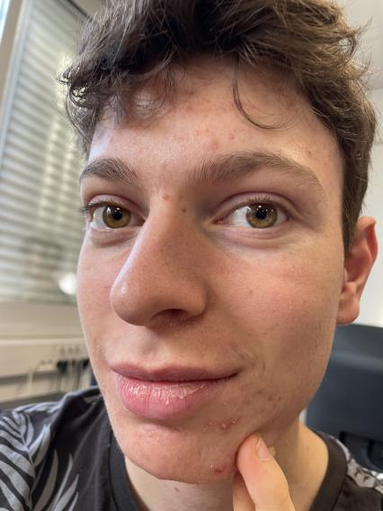

# Bienvenue sur le Wiki VincentBG76 !
[Wiki Vincent Fandom](https://vincentanal76.fandom.com/fr/wiki/Wiki_VincentAnal76)

**_Tout d'abord, voici Vincent !_**
------

Ici est un lieu de communauté où les fan de Vincent MELIAND peuvent s'instruire et se divertir sur sa vie, ses passions et ses fantasmes.

Fascinent hasard, lorsque cette page fut créé, l'ajout du numéro 76 fut inséré pour faire "rigoler la galerie" comme disent les jeunes. C'est avec l'étonnement des plus total que lorsque je regarda où le 76 se situait que j'appris que **Vincent en était originaire !**. Le hasard fait bien les choses, moi fan de Vincent depuis que je le connais, **j'ai réussis à trouver le département où il est né** (Plus particulièrement Rouen, ville du 76).

Cette anecdote me fait une transition parfaite pour vous introduire qui est Vincent.

comme dit plus tôt, Vincent est né à Rouen le 20 Avril 2005. un papa Camerounais et une mère Française, ils emménagent à Pélissanne, Proche de Salon en 2007. Il décide à 4 ans de reprendre l'entreprise de son père qu'il fera coulé 1 mois après. Déçu de son échec, sa mère décide de l'envoyer en IUT informatique pour qu'il réussisse quelque chose dans sa vie (pas très concluant pour l'instant vu la SAE sur la Green tech qu'il a proposé). Heureusement que Vincent possède des skills propre à lui:
# Ses Skills :
### Competence 1 - GROS MUSCLE :

En plus d'être **énormément beau**, Vincent est aussi **très musclé**, très assidu sur les séances de sport avec Simon (non mais il fait de son mieux).
Il vient **en courant** le matin et même avec ça il arrive toujours à être **en retard** 💪. (il dort avec des **bouchons d'oreille** en même temps... plus gros muscle que son cerveau).

### Competence 2 - Bonhomme :

Gros muscle et grosse mentalité de mâle alpha, en effet, il joue à CS-GO toute la journée cumulant pas moins de 2200 heures de jeu ce qui reviens à jouer près de 92 jours, jours et nuits sans s'arrêter. Tout ça pour insulter tout le lobby et se prendre la tête avec des Russes. 
***
Si Vincent était un personnage d'un jeu vidéo, il serait sûrement le personnages secondaires du héros dû au fait qu'il n'est pas très intéressant (pas de passions) Je me suis imaginais ses statistiques et sont caractère, armes, ect...

# Voici Vincent le pnj

Bien que dans la vrai vie Vincent se comporte comme un pnj, ici on s'intéresse au **Personnage-Non-Joueur** qui va aider le personnage principale dans sa quête.

**Statistiques de Vincent :**

    Force    ★★★★★
    Rapidité ★★★★✰
    Magie    ★✰✰✰✰
    Vision   ★★★✰✰
    Defense  ★★✰✰✰
    Attaque  ★★★★✰

La classe de Vincent serait assassin car il est rapide est fort, beaucoup d'attaque pour éliminer sa cible le plus rapidement possible en évitent de devoir défendre. Il ne pourrait donc pas être mage car il n'a pas de puissance magique ni Chevalier car il faut pouvoir se défendre correctement.

en arme il aurait une arme à distance pour pouvoir éliminer ses cibles discrètement et un couteau pour garder sa vitesse d'attaque. Pas besoin d'une grosse arme vu qu'il n'a pas beaucoup de défense.

Dans le jeu, Vincent arrivera tout le temps en retard et n'arrivera pas à se lever à l'heure. Un personnage pas ponctuel qui sera détester par les joueurs comme sa famille.

